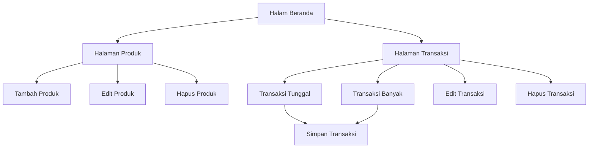

# Dokumentasi Persyaratan Produk - Sistem Manajemen Reseller

## 1. Ikhtisar Produk

Sistem Manajemen Reseller adalah aplikasi web untuk mengelola inventaris produk dan mencatat transaksi penjualan/reseller. Produk ini dirancang untuk membantu reseller mengelola stok, harga, dan riwayat transaksi dengan mudah.

**Target Pengguna**: Reseller yang membutuhkan sistem manajemen inventaris dan penjualan yang sederhana dan efisien.

## 2. Fitur Utama

### 2.1 Peran Pengguna

| Peran | Metode Registrasi               | Izin Utama                                       |
| ----- | ------------------------------- | ------------------------------------------------ |
| Admin | Tidak diperlukan (sistem lokal) | Mengelola produk, transaksi, dan melihat laporan |

### 2.2 Modul Fitur

Sistem manajemen reseller terdiri dari halaman-halaman utama berikut:

1. **Halaman Beranda**: Navigasi utama, kartu fitur, statistik cepat
2. **Halaman Produk**: Daftar produk, filter, pencarian, pembuatan produk baru, edit, hapus
3. **Halaman Transaksi**: Daftar transaksi, filter tanggal, pencarian, pembuatan transaksi tunggal/banyak

### 2.3 Detail Halaman

| Nama Halaman      | Nama Modul             | Deskripsi Fitur                                                                       |
| ----------------- | ---------------------- | ------------------------------------------------------------------------------------- |
| Halaman Beranda   | Navigasi               | Tampilkan menu navigasi ke halaman Produk dan Transaksi                               |
|              | Kartu Fitur            | Tampilkan 3 kartu fitur utama: Kelola Produk, Catat Transaksi, Pantau Penjualan       |
|              | Statistik Cepat        | Tampilkan total produk, total transaksi, dan total pendapatan                         |
| Halaman Produk    | Daftar Produk          | Tampilkan daftar produk dengan gambar, nama, ukuran, harga jual, harga default        |
|              | Pencarian              | Filter produk berdasarkan nama dengan input pencarian                                 |
|              | Pagination             | Navigasi antar halaman dengan tombol sebelumnya/selanjutnya                           |
|              | Sorting                | Urutkan produk berdasarkan tanggal (terbaru/terlama)                                  |
|              | Form Tambah Produk     | Input nama, ukuran tipe, gambar, harga default, harga jual                            |
|              | Edit Produk            | Tombol edit untuk memodifikasi data produk                                            |
|              | Hapus Produk           | Tombol hapus dengan konfirmasi dialog                                                 |
| Halaman Transaksi | Daftar Transaksi       | Tampilkan daftar transaksi dengan badge penjualan/retur, nama produk, tanggal, jumlah |
|              | Filter Tanggal         | Pilih rentang tanggal untuk filter transaksi                                          |
|              | Pencarian              | Filter transaksi berdasarkan nama produk                                              |
|              | Pagination             | Navigasi antar halaman dengan tombol sebelumnya/selanjutnya                           |
|              | Sorting                | Urutkan transaksi berdasarkan tanggal (terbaru/terlama)                               |
|              | Form Transaksi Tunggal | Pilih produk dari dropdown, input jumlah, tanggal, keterangan                         |
|              | Form Transaksi Banyak  | Tambah beberapa item transaksi sekaligus dengan dropdown produk dinamis               |
|              | Dropdown Produk        | Dropdown dinamis yang memuat daftar produk dari API                                   |
|              | Edit Transaksi         | Tombol edit untuk memodifikasi data transaksi                                         |
|              | Hapus Transaksi        | Tombol hapus dengan konfirmasi dialog                                                 |

## 3. Alur Utama

### Alur Pengguna Admin

**Alur Manajemen Produk**:

1. Pengguna membuka halaman Produk
2. Pengguna melihat daftar produk yang ada
3. Pengguna dapat mencari produk berdasarkan nama
4. Pengguna dapat menambah produk baru dengan mengisi form
5. Pengguna dapat mengedit produk yang sudah ada
6. Pengguna dapat menghapus produk dengan konfirmasi

**Alur Manajemen Transaksi**:

1. Pengguna membuka halaman Transaksi
2. Pengguna melihat daftar transaksi yang ada
3. Pengguna dapat mencari transaksi berdasarkan nama produk
4. Pengguna dapat filter berdasarkan rentang tanggal
5. Pengguna dapat menambah transaksi tunggal dengan memilih produk dari dropdown
6. Pengguna dapat menambah banyak transaksi sekaligus
7. Pengguna dapat mengedit transaksi yang sudah ada
8. Pengguna dapat menghapus transaksi dengan konfirmasi

### Flowchart Navigasi Halaman

## 4. Desain Antarmuka Pengguna

### 4.1 Gaya Desain

**Elemen Utama UI**:

* **Warna Utama**: Gradient ungu-biru (#667eea ke #764ba2)

* **Warna Sekunder**: Putih (#ffffff) untuk background kartu

* **Warna Aksen**: Hijau (#28a745) untuk penjualan, Merah (#dc3545) untuk retur, Kuning (#ffc107) untuk edit

* **Style Tombol**: Rounded corners (10px), gradient background, hover effect dengan shadow

* **Font**: Segoe UI, Tahoma, Geneva, Verdana, sans-serif

* **Layout**: Card-based dengan Bootstrap grid system

* **Icon**: Bootstrap Icons (bi-\*)

### 4.2 Desain Halaman

| Nama Halaman      | Nama Modul       | Elemen UI                                                                            |
| ----------------- | ---------------- | ------------------------------------------------------------------------------------ |
| Halaman Beranda   | Navigasi         | Navbar dengan background gelap, logo, menu navigasi                                  |
|              | Kartu Fitur      | Card putih dengan icon lingkaran gradient, title, description, tombol CTA            |
|              | Statistik Cepat  | Card putih dengan angka besar, label deskriptif                                      |
| Halaman Produk    | Daftar Produk    | List item dengan gambar produk (80x80px), nama, ukuran, harga, tombol action         |
|              | Filter           | Input pencarian dengan icon, tombol filter, tombol sorting                           |
|              | Pagination       | Button centered dengan label halaman, disabled state untuk invalid navigation        |
|              | Form Tambah      | Input field dengan border rounded, placeholder, required validation                  |
| Halaman Transaksi | Daftar Transaksi | List item dengan badge penjualan/retur, nama produk, tanggal, jumlah, tombol action  |
|              | Accordion        | Accordion dengan 2 panel: Transaksi Tunggal dan Transaksi Banyak                     |
|              | Form Transaksi   | Dropdown produk dengan required validation, input jumlah, tanggal picker, keterangan |
|              | Dropdown Produk  | Select dengan option default "-- Pilih Produk --", dinamis populated dari API        |

### 4.3 Responsivitas

* **Desktop-first**: Desain dioptimalkan untuk desktop

* **Mobile-adaptive**: Layout menyesuaikan untuk layar mobile dengan Bootstrap responsive classes

* **Touch Optimization**: Tombol dengan padding yang cukup untuk touch interaction

## 5. Catatan Penting

### 5.1 Masalah Diketahui

1. **Dropdown Produk Tidak Muncul**: Dropdown produk pada form transaksi tidak menampilkan opsi meskipun data berhasil diambil dari API (lihat <mcfile name="technical_architecture_analysis.md" path="e:\Code\Go\Me\Reseller\.trae\documents\technical_architecture_analysis.md"></mcfile> untuk detail teknis)

2. **Konvensi Penamaan Tidak Konsisten**: Terdapat ketidakkonsistenan antara `typeSize` (camelCase) dan `type_size` (snake\_case) di berbagai file frontend

3. **Timing Issues**: Dynamic content loading menggunakan timeout 100ms yang mungkin tidak cukup untuk DOM render

### 5.2 Rekomendasi Perbaikan

1. **Perbaiki Dropdown**: Implementasikan solusi yang direkomendasikan dalam analisis arsitektur teknis
2. **Standardisasi Penamaan**: Gunakan snake\_case untuk semua field dari API response
3. **Perbaiki Timing**: Ganti timeout dengan MutationObserver atau event listener yang lebih reliable
4. **Testing**: Lakukan testing mendalam pada fitur dropdown setelah perbaikan

### 5.3 Fitur Future

1. Statistik real-time pada halaman beranda
2. Export data ke CSV/Excel
3. Chart visualisasi penjualan
4. Multi-user authentication
5. Notifikasi stok rendah
6. Integration dengan payment gateway

