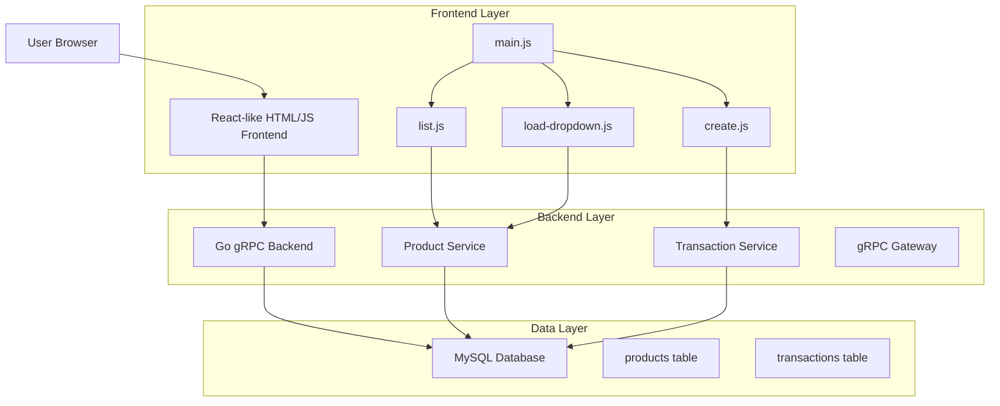
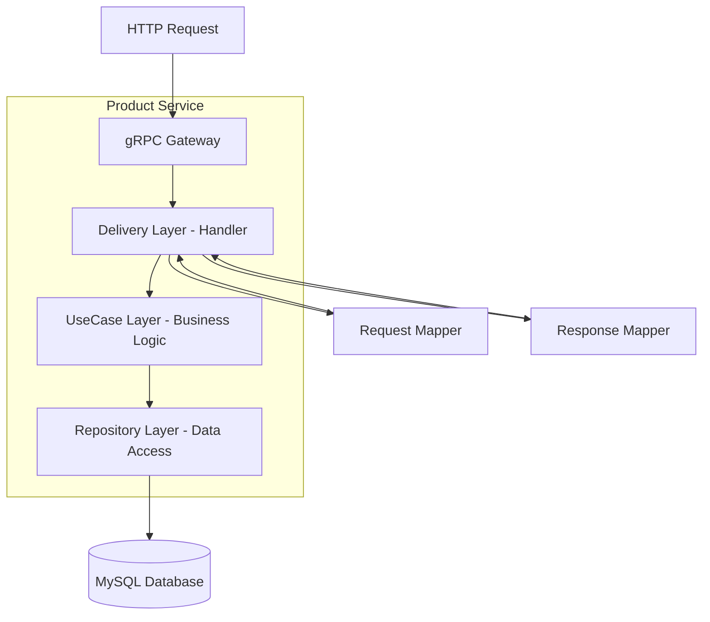
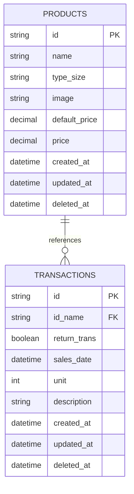
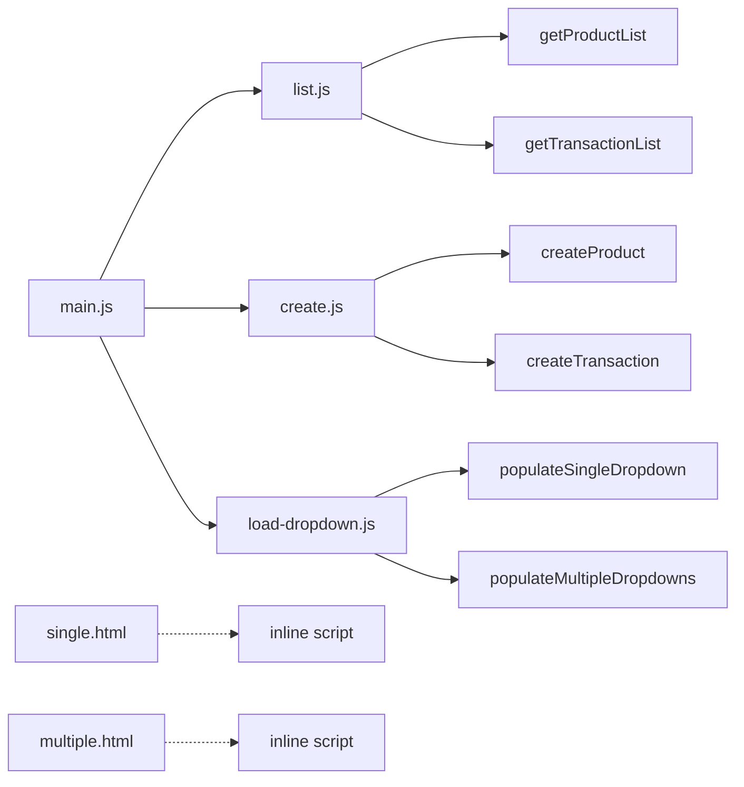

# Analisis Arsitektur Teknis - Reseller Management System

## 1. Arsitektur Desain



## 2. Deskripsi Teknologi

### Frontend
- **Framework**: Vanilla JavaScript (ES6 Modules)
- **Libraries**: Bootstrap 5, jQuery, Moment.js, DateRangePicker, Axios
- **Module System**: ES6 Modules (`export`/`import`)

### Backend
- **Language**: Go 1.x
- **Architecture**: Clean Architecture + gRPC
- **Protocol**: gRPC with HTTP Gateway (protobuf)
- **Database**: MySQL

## 3. Definisi Route Frontend

| Route | Tujuan |
|-------|--------|
| `/` | Halaman beranda dengan navigasi utama |
| `/product` | Halaman manajemen produk (list dan create) |
| `/transaction` | Halaman manajemen transaksi (list dan create) |
| `/html/transaction/single.html` | Form transaksi tunggal (dynamic content) |
| `/html/transaction/multiple.html` | Form transaksi banyak (dynamic content) |

## 4. Definisi API Backend

### 4.1 Core API - Product Service

**Get Product List**
```
GET /api/v1/product/list
```

Request Parameters:
| Param Name | Param Type | isRequired | Description |
|------------|------------|------------|-------------|
| q | string | false | Search query untuk nama produk |
| order_by | string | false | Field untuk ordering |
| limit | uint32 | false | Jumlah data per halaman |
| offset | uint32 | false | Offset untuk pagination |
| sort | string | false | Sorting direction (asc/desc) |

Response:
```json
{
  "data": [
    {
      "id": "uuid-string",
      "name": "Product Name",
      "type_size": "XL",
      "image": "image-path.jpg",
      "default_price": 100000,
      "price": 85000,
      "created_at": "2024-06-04T15:11:05Z",
      "updated_at": "2024-06-04T15:11:05Z"
    }
  ],
  "meta": {
    "count": 10
  }
}
```

**Create Product**
```
POST /api/v1/product/create
```

Request Body:
```json
{
  "name": "Product Name",
  "typeSize": "XL",
  "image": "image-path.jpg",
  "defaultPrice": 100000,
  "price": 85000
}
```

**Delete Product**
```
POST /api/v1/product/delete/{id}
```

### 4.2 Core API - Transaction Service

**Get Transaction List**
```
GET /api/v1/transaction/list
```

Request Parameters:
| Param Name | Param Type | isRequired | Description |
|------------|------------|------------|-------------|
| q | string | false | Search query |
| order_by | string | false | Field untuk ordering |
| limit | uint32 | false | Jumlah data per halaman |
| offset | uint32 | false | Offset untuk pagination |
| sort | string | false | Sorting direction (asc/desc) |
| startDate | string | false | Tanggal awal filter |
| endDate | string | false | Tanggal akhir filter |

**Create Transaction**
```
POST /api/v1/transaction/create
```

Request Body:
```json
{
  "idName": "product-uuid",
  "returnItem": false,
  "salesDate": "2024-06-04",
  "unit": 5,
  "description": "Keterangan transaksi"
}
```

**Delete Transaction**
```
POST /api/v1/transaction/delete/{id}
```

## 5. Diagram Arsitektur Server



## 6. Model Data

### 6.1 Definisi Model Data



### 6.2 Data Definition Language

**Products Table**
```sql
CREATE TABLE products (
    id              VARCHAR(225) NOT NULL UNIQUE,
    name            VARCHAR(255),
    type_size       VARCHAR(255),
    image           VARCHAR(255),
    default_price   DECIMAL(15,2) DEFAULT 0.00,
    price           DECIMAL(15,2) DEFAULT 0.00,
    created_at      DATETIME DEFAULT NOW(),
    updated_at      DATETIME DEFAULT NOW(),
    deleted_at      DATETIME DEFAULT NULL,
    PRIMARY KEY(id)
);
```

**Transactions Table**
```sql
CREATE TABLE transactions (
    id                    VARCHAR(225) NOT NULL UNIQUE,
    id_name               VARCHAR(255),
    return_trans          BOOLEAN DEFAULT FALSE,
    sales_date            DATETIME DEFAULT NOW(),
    unit                  INT DEFAULT 0,
    description           VARCHAR(255),
    created_at            DATETIME DEFAULT NOW(),
    updated_at            DATETIME DEFAULT NOW(),
    deleted_at            DATETIME DEFAULT NULL,
    PRIMARY KEY(id)
);
```

## 7. Konvensi Penamaan Field

### Backend (Go & Protobuf)

| Layer | Convention | Example |
|-------|-----------|---------|
| Go Entity Struct | CamelCase (PascalCase) | `TypeSize` |
| Go Model GORM | Snake Case (gorm tag) | `type_size` |
| Protobuf Message | Snake Case | `type_size` |
| Database Column | Snake Case | `type_size` |

**Flow Konversi Field:**
1. **Database → Model**: `type_size` → `TypeSize` (struct field)
2. **Model → Entity**: `TypeSize` → `TypeSize` (dto field)
3. **Entity → Protobuf**: `TypeSize` → `type_size` (protobuf field)
4. **Protobuf → JSON Response**: `type_size` → `type_size` (JSON)

### Frontend (JavaScript)

| Context | Convention | Example |
|---------|-----------|---------|
| Form Fields | CamelCase | `typeSize` |
| API Response | Snake Case | `type_size` |
| DOM IDs | CamelCase | `typeSize` |
| JavaScript Variables | CamelCase | `typeSize` |

## 8. Struktur File Frontend

### 8.1 Organisasi File

```
services/html/js/
├── main.js                      # Dynamic content loader & DateRangePicker
├── library/                     # External libraries
│   ├── axios.min.js
│   ├── bootstrap.min.js
│   ├── jquery.min.js
│   ├── moment.min.js
│   └── daterangepicker.js
├── product/
│   ├── list.js                  # Product list functionality
│   └── create.js                # Product creation
└── transaction/
    ├── list.js                  # Transaction list & dropdown loading
    ├── create.js                # Transaction creation
    ├── load-dropdown.js         # Dropdown population logic
    ├── dropdown.js              # (Additional dropdown logic)
    └── dropdown-inline.js       # (Inline dropdown logic)
```

### 8.2 Dependensi Antar File



## 9. Mekanisme Loading Dropdown

### 9.1 Flow Loading Dropdown

1. **Initial Load** (<mcfile name="transaction/index.html" path="e:\Code\Go\Me\Reseller\services\html\transaction\index.html"></mcfile> lines 339-340):
   - `list.js` dimuat sebagai module
   - `main.js` dimuat sebagai module
   - Event `DOMContentLoaded` memanggil `loadAll()`

2. **Dynamic HTML Loading** (<mcfile name="main.js" path="e:\Code\Go\Me\Reseller\services\html\js\main.js"></mcfile> lines 98-107):
   - `loadAll()` memanggil `loadHTML()` untuk single dan multiple transaction
   - `loadHTML()` fetch HTML dari `/html/transaction/single.html` dan `/html/transaction/multiple.html`
   - Setelah HTML dimuat, cek apakah `window.loadProductDropdown` tersedia

3. **Dropdown Population** (<mcfile name="list.js" path="e:\Code\Go\Me\Reseller\services\html\js\transaction\list.js"></mcfile> lines 208-233):
   - `loadProductDropdown()` fetch data produk dari API
   - Simpan di `window.allProducts`
   - Panggil `populateSingleDropdown()` dan `populateMultipleDropdowns()`

### 9.2 Inline Script dalam Dynamic HTML

**single.html** (<mcfile name="single.html" path="e:\Code\Go\Me\Reseller\services\html\transaction\single.html"></mcfile> lines 102-149):
- Menggunakan `product.type_size` (snake_case)
- Inline script dijalankan segera setelah HTML dimuat
- **ISSUE**: Tidak sinkron dengan backend response yang juga menggunakan `type_size`

**multiple.html** (<mcfile name="multiple.html" path="e:\Code\Go\Me\Reseller\services\html\transaction\multiple.html"></mcfile> lines 112-158):
- Menggunakan `product.type_size` (snake_case)
- Similar issue dengan single.html

## 10. Root Cause Analysis: Dropdown Tidak Muncul di UI

### 10.1 Masalah Utama

**Issue 1: Konvensi Penamaan Tidak Konsisten**
- **Backend Response**: JSON menggunakan `type_size` (snake_case) dari protobuf
- **Frontend**: Beberapa file menggunakan `typeSize` (camelCase), lainnya `type_size` (snake_case)
- **Product List** (<mcfile name="list.js" path="e:\Code\Go\Me\Reseller\services\html\js\transaction\list.js"></mcfile> line 65): Menggunakan `product.typeSize` (camelCase)
- **Transaction List** (<mcfile name="list.js" path="e:\Code\Go\Me\Reseller\services\html\js\transaction\list.js"></mcfile> line 294): Menggunakan `product.type_size` (snake_case)
- **Create Product** (<mcfile name="create.js" path="e:\Code\Go\Me\Reseller\services\html\js\product\create.js"></mcfile> line 5): Menggunakan `typeSize` (camelCase)

**Issue 2: Timing Issue dengan Dynamic Content**
- `main.js` line 78-91: Timeout 100ms mungkin tidak cukup untuk DOM render
- Inline script di dynamic HTML (`single.html` dan `multiple.html`) dieksekusi setelah HTML dimuat
- Tidak ada jaminan urutan eksekusi antara inline script dan fungsi `loadProductDropdown()` dari `list.js`

**Issue 3: Race Condition**
- `list.js` line 203-206: Event listener `DOMContentLoaded` tidak memanggil dropdown loading
- `main.js` line 116-121: Event listener `window.load` mencoba memanggil `populateDropdowns()` tapi timing tidak terjamin

### 10.2 Mengapa Console Log Menunjuk Sukses tapi UI Tidak Update

Console logs menunjukkan sukses karena:
1. API call berhasil dan data diterima
2. Fungsi `populateSingleDropdown()` dieksekusi
3. DOM element ditemukan (`idName` element found)

Tapi UI tidak update karena:
1. **DOM Timing**: Element `#idName` mungkin belum dirender saat fungsi dijalankan
2. **Event Conflict**: Inline script di `single.html` line 102-149 mungkin menimpa dropdown
3. **Scope Issue**: Fungsi dipanggil dari module tapi inline script di global scope

### 10.3 Evidence dari Kode

**Evidence 1: Naming Inconsistency**
```javascript
// list.js line 65 - Product list display
const typeSize = product.typeSize || '-';  // camelCase

// list.js line 294 - Multiple dropdown population
const typeSize = product.type_size || '-';  // snake_case

// single.html line 130 - Inline script
option.text = product.name + ' (' + product.type_size + ')';  // snake_case
```

**Evidence 2: Timing Issue**
```javascript
// main.js lines 77-82
setTimeout(() => {
    if (window.loadProductDropdown) {
        window.loadProductDropdown();
    }
}, 100);  // Arbitrary 100ms delay
```

**Evidence 3: Race Condition**
```javascript
// list.js lines 203-206
document.addEventListener('DOMContentLoaded', () => {
    getTransactionList();
    // Don't load dropdown here - it will be called after dynamic content loads
});
```

## 11. Rekomendasi Perbaikan

### 11.1 Perbaiki Konvensi Penamaan

**Standardisasi ke snake_case untuk API response**:
```javascript
// Update semua file frontend untuk menggunakan type_size
const typeSize = product.type_size || '-';  // Consistent snake_case
```

**Lokasi file yang perlu diupdate**:
- <mcfile name="list.js" path="e:\Code\Go\Me\Reseller\services\html\js\product\list.js"></mcfile> line 65
- <mcfile name="list.js" path="e:\Code\Go\Me\Reseller\services\html\js\transaction\list.js"></mcfile> line 257
- <mcfile name="create.js" path="e:\Code\Go\Me\Reseller\services\html\js\transaction\create.js"></mcfile> line 182

### 11.2 Perbaiki Timing dan Race Condition

**Opsi 1: Hapus Inline Script dari Dynamic HTML**
- Hapus script inline dari <mcfile name="single.html" path="e:\Code\Go\Me\Reseller\services\html\transaction\single.html"></mcfile> lines 102-149
- Hapus script inline dari <mcfile name="multiple.html" path="e:\Code\Go\Me\Reseller\services\html\transaction\multiple.html"></mcfile> lines 112-158
- Biarkan `loadProductDropdown()` di `list.js` menangani semua dropdown

**Opsi 2: Gunakan MutationObserver untuk DOM Ready**
```javascript
// main.js - Replace setTimeout with MutationObserver
function loadHTML(id, url) {
    const container = document.getElementById(id);
    if (!container) return;

    fetch(url)
        .then(res => res.text())
        .then(html => {
            container.innerHTML = html;
            
            // Use MutationObserver instead of setTimeout
            const observer = new MutationObserver((mutations, obs) => {
                const dropdown = container.querySelector('.form-select');
                if (dropdown && window.loadProductDropdown) {
                    window.loadProductDropdown();
                    obs.disconnect();
                }
            });
            
            observer.observe(container, { childList: true, subtree: true });
            
            // Timeout fallback
            setTimeout(() => observer.disconnect(), 1000);
        });
}
```

**Opsi 3: Konsolidasi Semua Dropdown Logic**
- Pindahkan semua dropdown logic ke satu file terpusat
- Hapus inline script sepenuhnya
- Gunakan event delegation untuk dynamic elements

### 11.3 Rekomendasi Implementasi Cepat

**Langkah 1: Update Konvensi Penamaan**
```bash
# Find and replace typeSize -> type_size in all JS files
```

**Langkah 2: Hapus Inline Script**
- Hapus `<script>` block dari `single.html` dan `multiple.html`
- Biarkan `list.js` handle dropdown loading

**Langkah 3: Perbaiki main.js**
```javascript
// main.js - Better timing with DOMContentLoaded on dynamic content
function loadHTML(id, url) {
    const container = document.getElementById(id);
    if (!container) return;

    fetch(url)
        .then(res => res.text())
        .then(html => {
            container.innerHTML = html;
            
            // Wait for DOM to be ready
            if (document.readyState === 'loading') {
                document.addEventListener('DOMContentLoaded', () => {
                    if (window.loadProductDropdown) {
                        window.loadProductDropdown();
                    }
                });
            } else {
                if (window.loadProductDropdown) {
                    window.loadProductDropdown();
                }
            }
        });
}
```

## 12. Summary

### Problem Statement
Dropdown produk tidak muncul di UI meskipun console log menunjukkan data berhasil diambil dan fungsi dieksekusi.

### Root Causes
1. **Inconsistent Naming Convention**: `typeSize` vs `type_size` di berbagai file
2. **Timing Issues**: Timeout 100ms tidak cukup untuk DOM render
3. **Race Conditions**: Inline script di dynamic HTML conflict dengan fungsi dari module
4. **Scope Issues**: Module functions tidak accessible di inline script

### Recommended Fixes
1. Standardisasi ke `type_size` (snake_case) untuk semua API response access
2. Hapus inline script dari dynamic HTML
3. Gunakan MutationObserver atau DOMContentLoaded event yang lebih reliable
4. Konsolidasi dropdown logic ke satu file terpusat

### Priority
1. **High**: Fix naming inconsistency (breaks functionality)
2. **High**: Remove inline scripts (causes race conditions)
3. **Medium**: Improve timing mechanism (improves reliability)
4. **Low**: Refactor for better architecture (long-term maintainability)
